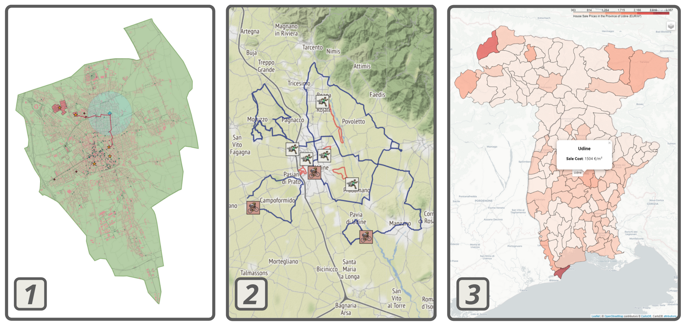

# **Exploring Udine and its Municipalities**

<br>
<p align="center"></p>
<h2 align="center"><b>Course</b></h2>
<h3 align="center"><i>Geospatial Analysis and Representation for Data Science (2021-2022)</i></h3>


<br><br>
<p align="center"></p>
<h2 align="center"><b>Aim of the Project</b></h2>

The project focuses on Udine and its municipalities. It is mainly aimed at students interested in studying and moving to the city.

<br><br>
<p align="center"></p>
<h2 align="center"><b>Structure</b></h2>

The project is divided into three main parts:

1. *Static map of Udine, with universities and points of interest*

    It provides the main information about the city.

2. *Interactive map of Udine with real walking and cycling routes*

    The map is designed for those who want to train and test themselves.

3. *Geospatial analysis of average house prices and rents in the province of Udine*

    Interesting for those planning to move to Udine or its vicinity. It provides useful hints and considerations about the influence of each municipality on prices in neighbouring municipalities.



<br><br>
<p align="center"></p>
<h2 align="center"><b>How to execute the code (Python)</b></h2>
<p align="center">The following is a list of methods by which you can install the necessary tools to run the Python code on your system.</p>

### **Solution 1: Anaconda environment**

*Note: this solution has been tested on Windows and Linux operating systems.*

- If you want to run the code on your own machine, it is **strongly recommended** to use the package manager `conda` of the [Anaconda](https://www.anaconda.com/) distribution.

- In the `environment` folder you will find the file `environment.yaml`, download it.

- You can recreate the environment using the command:

    ```cmd
    conda env create --file environment.yaml
    ```

    Note that you don't need to specify the env name, which is `GEO_PROJ` and is already contained within the `.yaml` file. It is not needed to specify the version of Python either, as `Python 3.9.9` will be installed automatically.

- You can now activate the environment with the command:

    ```cmd
    conda activate GEO_PROJ
    ```

    This is usually recognised by the terminal, which will look like this:

    ```cmd
    (GEO_PROJ) ...
    ```

- It is now possible to execute the code.

---

#### **Why not use `pip`?**

Some packages are installed using the `conda` or `conda-forge` channel. Not all dependencies are available in `pip`, and this leads to errors.

However, a `requirements.txt` file has been created which shows the list of required packages.

It is **not recommended** to use the classic `pip install -r requirements.txt` command, as it will almost certainly lead to errors.

---

### **Solution 2: install the packages manually**

If you don't want to use `conda` or can't use the `.yaml` file, you can try installing the main needed packages manually.

It is recommended to create a new virtual environment, activate it and then follow the package documentation for installation.

- [pandas==1.3.5](https://pandas.pydata.org/getting_started.html)
- [geopandas==0.10.2](https://geopandas.org/en/stable/getting_started/install.html)
- [pygeos==0.12.0](https://pygeos.readthedocs.io/en/stable/installation.html)
- [pyrosm==0.6.1](https://pyrosm.readthedocs.io/en/latest/installation.html) --> it **must** be installed after `geopandas` in Windows
- [matplotlib==3.5.1](https://matplotlib.org/stable/users/installing/index.html)
- [geopy==2.2.0](https://geopy.readthedocs.io/en/stable/#installation)
- [osmnx==1.1.2](https://osmnx.readthedocs.io/en/stable/)
- [gpxpy==1.5.0](https://pypi.org/project/gpxpy/)
- [movingpandas==0.8rc1](https://anaconda.org/conda-forge/movingpandas)
- [contextily==1.2.0](https://contextily.readthedocs.io/en/latest/)
- [folium==0.12.1.post1](https://python-visualization.github.io/folium/installing.html)
- [leafmap==0.7.0](https://leafmap.org/installation/)

### **Alternative Solution: Online Notebooks**

All the notebooks are freely explorable on this [webpage](https://danielepassabi.github.io/uni/geo/geo_project.html). The code is already executed and you do not need to download anything.

<br><br>
<p align="center"></p>
<h2 align="center"><b>How to execute the code (R)</b></h2>

The list of libraries needed to execute the R code follows:

- `dplyr`
- `rgdal`
- `spdep`
- `ggplot2`

All packages can be installed with the following command:

```r
install.packages("package name", dependencies = TRUE)
```

### **Alternative Solution: Online Notebook**

The notebook is freely explorable [here](https://danielepassabi.github.io/uni/geo/nb/3_Analysis_of_House_Sale_and_Rent_Cost_in_Province_of_Udine_R.html). The code is already executed and you do not need to download anything.
