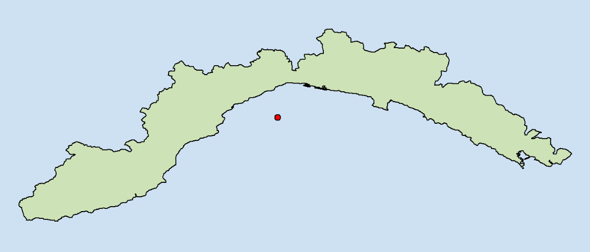
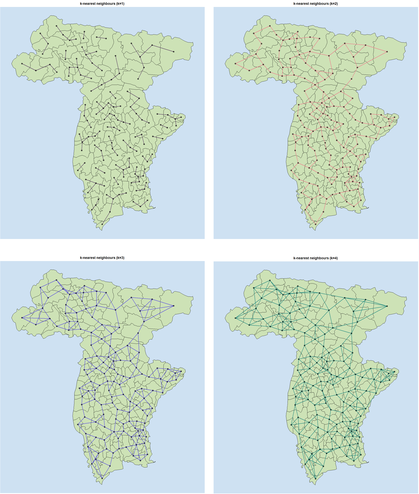
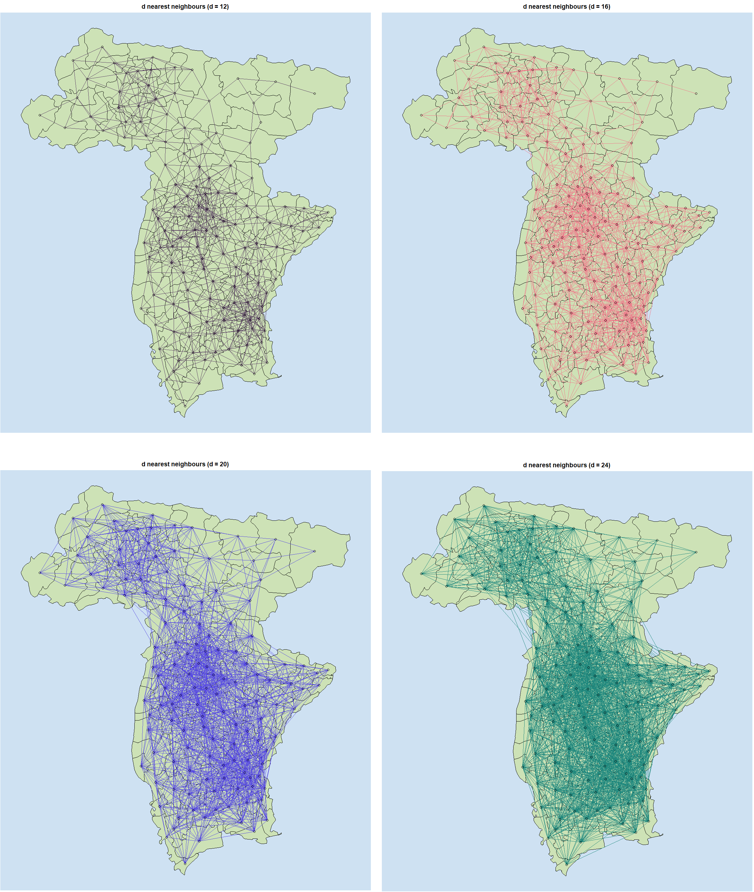
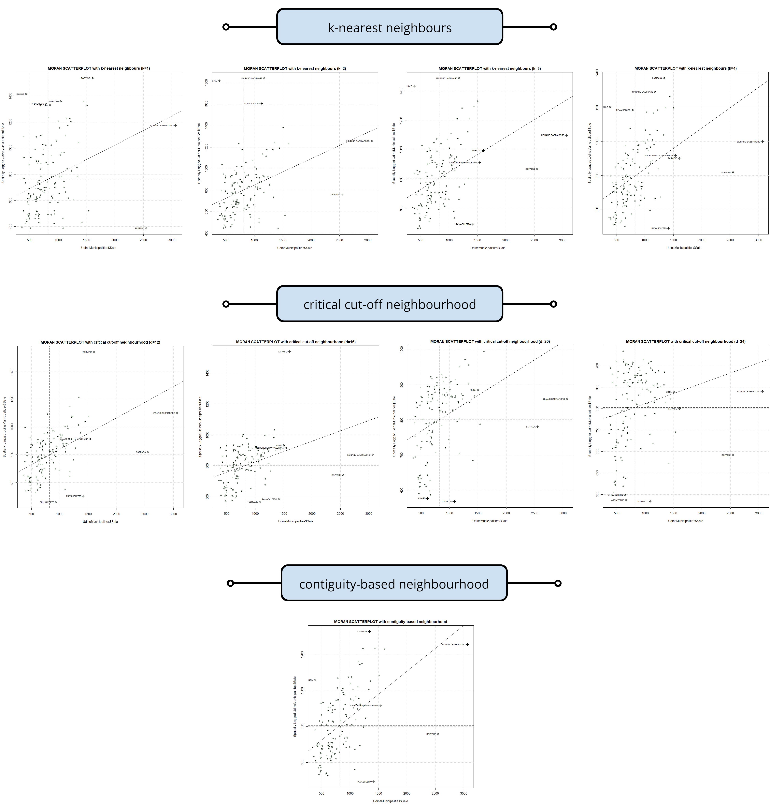
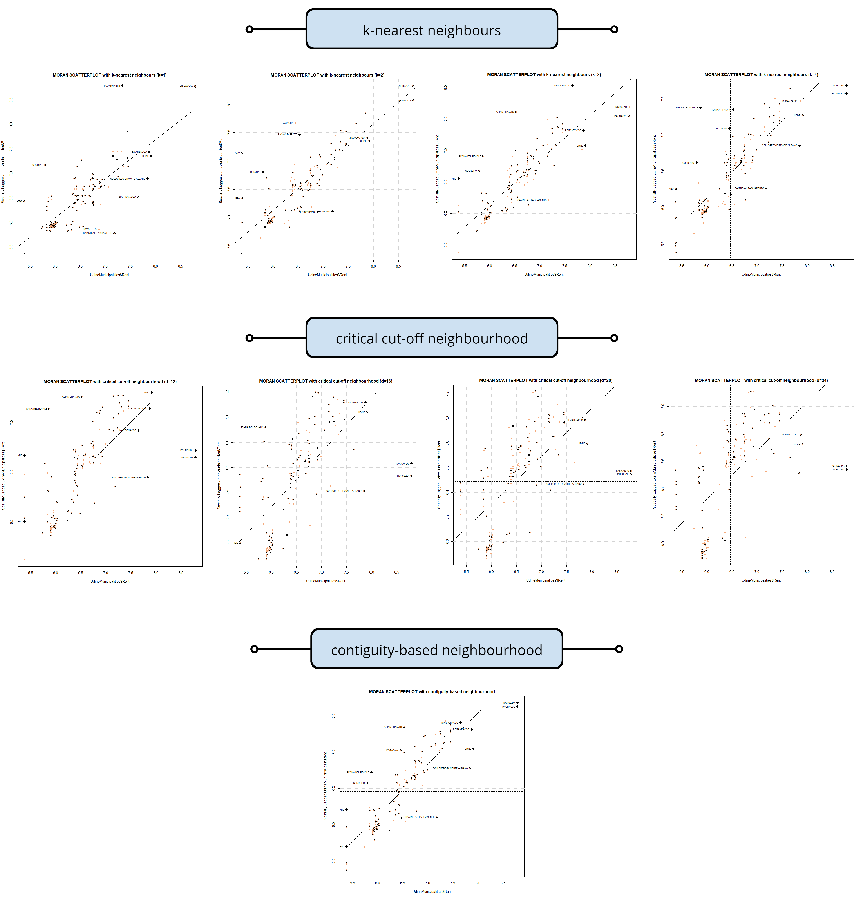
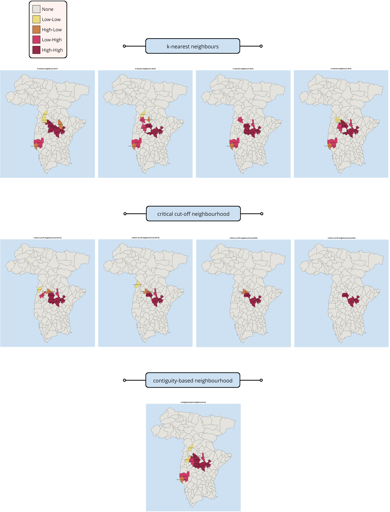
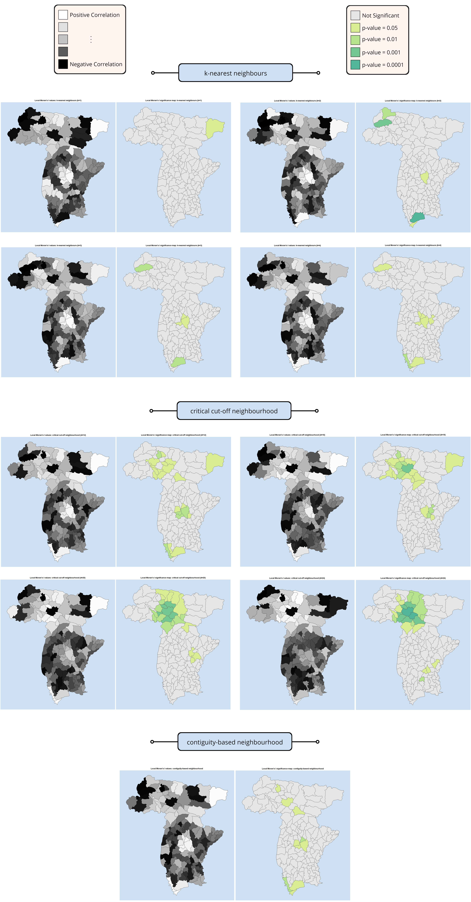

<style>
  body {text-align: justify;}
  .title {text-align: center;}
  .definition {
    background-color: #FFD885;
    padding: 0.5rem 1.5rem 0;
    border-radius: 4px;
    border: 1px solid #FFB20F;
    margin-bottom: 1rem;
    margin-top: 1rem;
  }
</style>

<br><div class="title">
# **Analysis of House Sale and Rent Cost in Province of Udine**
## **Project of Geospatial Analysis and Representation for Big Data**
### *Daniele Passabì, 221229*
</div>

<br>

## **Aim**

In this notebook we will perform **descriptive spatial statistical analyses**, both from a *global* and *local* perspective.

We will focus on municipalities in the Province of Udine, using data updated to December 2021 concerning the average price of houses and rents in each municipality.

Source of the data: [Immobiliare.it](https://www.immobiliare.it/mercato-immobiliare/friuli-venezia-giulia/udine-provincia/)

<br>

## **Import Libraries**

We import the packages needed for data analysis and visualisation.

```{r message=FALSE, warning=FALSE}

library(dplyr)    # data manipulation
library(rgdal)    # import and store a shapefile in R
library(spdep)    # analysis of spatial dependence
library(ggplot2)  # create visualizations
library(stringr)  # string manipulation

print("> Libraries Imported")

```

<br>

## **Import Data**

### **Udine Municipalities**

We first import the shapefile of all the municipalities in Italy.

```{r message=FALSE, warning=FALSE}

# import shapefile
italy_municipalities = readOGR("../data/Com01012021_g","Com01012021_g_WGS84")

# convert to epsg:4326
italy_municipalities = spTransform(italy_municipalities, CRS("+init=epsg:4326"))

# show sample
head(italy_municipalities@data)

```

We filter and keep only the Udine municipalities. They must be 134.

```{r}

udine_municipalities = italy_municipalities[italy_municipalities$COD_PROV == 30,] # 30 is the Province Code for Udine
udine_municipalities@data

```

Let's visualize the content of `udine_municipalities`.

```{r fig.height=14, fig.width=12, fig.align='center'}

# set plot margins
par(mar=c(0,0,0,0))

# create base plot
plot(
  udine_municipalities,
  col = "#CDE2B6",       # customize municipality color
  bg = "#CEE1F2",        # customize background color
  lwd = 2                # customize line width (municipality borders)
  )

# add name of municipality as text 
text(
  coordinates(udine_municipalities), 
  labels = udine_municipalities$COMUNE, 
  cex = 0.6, 
  col = "black"
  )

```

### **House Sale and Rent Data**

We now import data on house sales and rental costs and join them with our `udine_municipality` data.

```{r}

# we import the csv
house_sale_rent = read.csv("../data/udine_municipalities_house_cost.csv")

# we rename the column "Municipality" to "COMUNE", like the column in the shapefile
house_sale_rent = house_sale_rent %>%
  rename(COMUNE = Municipality)

# we join the data
udine_municipalities_with_house_cost = merge(udine_municipalities, house_sale_rent, by = "COMUNE")

# set all upper names for COMUNE (it will be useful later)
udine_municipalities_with_house_cost@data = udine_municipalities_with_house_cost@data %>%
  mutate(COMUNE = toupper(COMUNE))

# show results
udine_municipalities_with_house_cost@data %>%
  select(COMUNE, Sale, Rent)

```

<br>

## **Descriptive Spatial Statistics (Global Analysis)**

### **Centroids**

We need to assign each municipality a *unique spatial reference coordinate* to represent them. 

We can calculate the *centroids* of the municipalities. Remember that:

<div class="definition">
The centroid of a plane figure is the arithmetic mean position of all the points in the figure.
</div>

```{r}

udine_mun_coords = coordinates(udine_municipalities_with_house_cost)
udine_mun_coords[0:5,]

```

The centroids are arbitrary and may not fall within the polygon that defines them. 

One classic example is the one of Liguria and its centroid: 



Let us visualise our centroids to ensure that there are no such problems. 

```{r fig.height=14, fig.width=12, fig.align='center'}

par(mar=c(0,0,0,0))

plot(
  udine_municipalities_with_house_cost, 
  col = "#CDE2B6",
  bg = "#CEE1F2", 
  lwd = 2
  )

points(
  udine_mun_coords, 
  cex = 1,
  col = "black",
  bg = "#EF798A",
  pch = 21,
  lwd = 1.5
  )

```

There are two municipalities where the centroid is outside the territory.


This should not be a major problem for our analysis, but it is wise to take this into account for the upcoming results.

### **Neighbourhood Relationships**

Using the centroids we can now define the neighbourhood relationships amongst the municipalities (spatial units).

Of the different possible definitions of neighbourhood we have seen:

- *k-nearest neighbours*
- *critical cut-off neighbourhood*
- *contiguity-based neighbourhood*

Let us explore them.

#### **A. k-nearest neighbours**

<div class="definition">
The k-nearest neighbours entails that two spatial units are considered neighbours if their distance is equal, or less than equal, to the smallest possible distance that can be found between all the units.

Following this definition of neighbourhood, each spatial unit will have the same number k of neighbours.
</div>

In R we can use the function `knn2nb()`.

Note: we specify the parameter `longlat = True`, so that we do not use the Euclidean distance, but a distance that takes into account the fact that the Earth is not flat.

```{r fig.height=14, fig.width=12, fig.align='center'}

# we use different values of k
knn_UD_mun_k1 = knn2nb(knearneigh(udine_mun_coords, k = 1, longlat = T))
knn_UD_mun_k2 = knn2nb(knearneigh(udine_mun_coords, k = 2, longlat = T))
knn_UD_mun_k3 = knn2nb(knearneigh(udine_mun_coords, k = 3, longlat = T))
knn_UD_mun_k4 = knn2nb(knearneigh(udine_mun_coords, k = 4, longlat = T))

```

Let's visualize the results.

```{r}

# Create function for knn plot
plot_knn_res = function(shapefile, knn_obj, tie_color, k) {
  
  # set margins
  par(mar=c(0,0,2,0))

  # plot base map using shapefile
  plot(
    shapefile, 
    col = "#CDE2B6",
    bg = "#CEE1F2", 
    lwd = 1
  )
  
  # add custom title
  title(main = paste0("k-nearest neighbours (k=",k,")")) 

  # plot over base map knn results
  plot(
    knn_obj, 
    udine_mun_coords,
    add = T,
    col = tie_color,
    lwd = 2
    )
}

```

```{r fig.height=14, fig.width=12, fig.align='center'}

#plot_knn_res(udine_municipalities_with_house_cost, knn_UD_mun_k1, "#593F62", 1)
#plot_knn_res(udine_municipalities_with_house_cost, knn_UD_mun_k2, "#EF798A", 2)
#plot_knn_res(udine_municipalities_with_house_cost, knn_UD_mun_k3, "#574AE2", 3)
#plot_knn_res(udine_municipalities_with_house_cost, knn_UD_mun_k4, "#21897E", 4)

```

*Note: the code is commented to preserve the readability of the output. The results are shown in the image below.*

*It is recommended to open the visualisation in a new window to better appreciate it.*



#### **B. Critical cut-off neighbourhood**

<div class="definition">
According to the critical cut-off criterion, two spatial units are considered to be neighbours if their distance is equal to, or less than equal to, a certain fixed distance, the critical cut-off.
</div>

It should be remembered, however, that this distance should allow all units to have at least one neighbour.

Thus, let us find the minimum distance required.

```{r}

knn_UD_mun_k1 = knn2nb(knearneigh(udine_mun_coords, k = 1, longlat = T))
max_mun_distance = max(unlist(nbdists(knn_UD_mun_k1, udine_mun_coords, longlat = T))) 

message("The maximum distance between two municipalities is ", round(max_mun_distance,2), " km")

```

The cut-off distance has to be greater than 11.72 (km).

```{r}

# We try different neighbourhood definitions for different values of the cut-off distance
dnb12 = dnearneigh(udine_mun_coords, 0, 12, longlat = T); message("dnb12"); dnb12
dnb16 = dnearneigh(udine_mun_coords, 0, 16, longlat = T); message("dnb16"); dnb16 
dnb20 = dnearneigh(udine_mun_coords, 0, 20, longlat = T); message("dnb20"); dnb20 
dnb24 = dnearneigh(udine_mun_coords, 0, 24, longlat = T); message("dnb24"); dnb24 

```


```{r}

# Create function to plot results of dnearneigh()
plot_dnb_res = function(shapefile, dnb_obj, tie_color, title) {

  # set margins
  par(mar=c(0,0,2,0))
  
  # plot base map using shapefile
  plot(
    shapefile, 
    col = "#CDE2B6",
    bg = "#CEE1F2", 
    lwd = 1
  )
  
  # add custom title
  title(main = title) 

  # plot over base map knn results
  plot(
    dnb_obj, 
    udine_mun_coords,
    add = T,
    col = tie_color,
    lwd = 1
    )
}

```

```{r fig.height=14, fig.width=12, fig.align='center'}

#plot_dnb_res(udine_municipalities_with_house_cost, dnb12, "#593F62", "d nearest neighbours (d = 12)")
#plot_dnb_res(udine_municipalities_with_house_cost, dnb16, "#EF798A", "d nearest neighbours (d = 16)")
#plot_dnb_res(udine_municipalities_with_house_cost, dnb20, "#574AE2", "d nearest neighbours (d = 20)")
#plot_dnb_res(udine_municipalities_with_house_cost, dnb24, "#21897E", "d nearest neighbours (d = 24)")

```

*Note: the code is commented to preserve the readability of the output. The results are shown in the image below.*

*It is recommended to open the visualisation in a new window to better appreciate it.*



It is normal that as the critical cut-off increases, the number of connections increases.

In this case, however, even with the lowest value (12) of cut-off there seems to be a disproportion of connections between the north-eastern municipalities and the others.

This happens because the usual distance between the centroids tends to be much smaller than the maximum found. To make this concept clearer, we show a simple histogram of the distances. 

```{r fig.height=5, fig.width=10, fig.align='center'}

# save the distances data in a df for ggplot
distance_vector = unlist(nbdists(knn_UD_mun_k1, udine_mun_coords, longlat = T))
distance_df = data.frame(distance_vector)

# show histogram of distances
ggplot(distance_df, aes(x = distance_vector)) + 
  # create histogram
  geom_histogram(
    binwidth = 0.25, 
    fill = "#69b3a2", 
    color = "#e9ecef", 
    alpha = 0.9
    ) +
  # add labels
  labs(
    title = "\nDistances between Spatial Units",
    subtitle = "Obtained using KNN with K=1",
    x = "\ndistance (km)",
    y = "count\n"
  ) + 
  # add vertical lines for max distance and mean distance
  geom_vline(xintercept = max(distance_vector), color = "#C5283D", size = 1.25) + 
  geom_vline(xintercept = mean(distance_vector), color = "#255F85", size = 1.25, linetype = "dotted")

```

As we can see from the picture, most of the distances are not too far from the average, which is 4.57 (represented by the blue dotted line).

However, the cutoff value we have used is about 12 (red line), which is more than twice the average value of the distances. As a consequence, lots of municipalities have many neighbours.

#### **C. Contiguity-based neighbourhood**

<div class="definition">
The neighbourhood criterion based on contiguity states that two spatial units are considered neighbours if they share a common border.
</div>

```{r}

# Note on "queen" parameter from the documentation
#   if TRUE, a single shared boundary point meets the contiguity condition, 
#   if FALSE, more than one shared point is required

contnb_q = poly2nb(udine_municipalities_with_house_cost, queen = T)
contnb_q

```
Now we plot the results.

```{r fig.height=14, fig.width=12, fig.align='center'}

par(mar=c(0,0,2,0))

# plot base map using shapefile
plot(
  udine_municipalities_with_house_cost, 
  col = "#CDE2B6",
  bg = "#CEE1F2", 
  lwd = 1
)
  
# add custom title
title(main = "Contiguity-based neighbourhood") 

# plot results over base map 
plot(
  contnb_q, 
  udine_mun_coords,
  add = T,
  col = "#EF798A",
  lwd = 2
)

```

### **Defining Spatial Weights**

We have defined 9 neighbourhood relationships:

- 4 using *k-nearest neighbours*
- 4 using *critical cut-off neighbourhood*
- 1 using *contiguity-based neighbourhood*

Now we can create the spatial weights matrix, one for each neighbours list previously created.

```{r}

# k-nearest neighbours
knn_UD_mun_k1.listw = nb2listw(knn_UD_mun_k1, style = "W")
knn_UD_mun_k2.listw = nb2listw(knn_UD_mun_k2, style = "W")
knn_UD_mun_k3.listw = nb2listw(knn_UD_mun_k3, style = "W")
knn_UD_mun_k4.listw = nb2listw(knn_UD_mun_k4, style = "W")

# critical cut-off neighbourhood
dnb12.listw = nb2listw(dnb12, style = "W")
dnb16.listw = nb2listw(dnb16, style = "W")
dnb20.listw = nb2listw(dnb20, style = "W")
dnb24.listw = nb2listw(dnb24, style = "W")

# contiguity-based neighbourhood
contnb_q.listw = nb2listw(contnb_q, style = "W")

```

### **Moran's I test of spatial autocorrelation**

<div class="definition">
The *Moran's I test* is the most popular measure of (global) spatial autocorrelation of a variable.

It is given by:
$$
I=\frac{n}{\sum_{i=1}^{n} \sum_{j=1}^{n} w_{i j}} \frac{\sum_{i=1}^{n} \sum_{j=1}^{n} w_{i j}\left(x_{i}-\bar{x}\right)\left(x_{j}-\bar{x}\right)}{\sum_{i=1}^{n}\left(x_{i}-\bar{x}\right)^{2}}
$$

Its values range from:

- $-1 \rightarrow$ *negative* association
- $+1 \rightarrow$ *positive* association

If the value is close to $0$, that indicates absence of spatial autocorrelation.

</div>

Before we perform the *Moran's I test*, we visually inspect our two variables `Sale` and `Rent`.

We first report the choropleths maps obtained in Python.


And now we visualize the quantile distribution of the variables.

```{r}

plot_quantile_distr = function(shapefile, col_name){
  
  # set margins
  par(mar=c(0,0,2,0))
  
  # obtain brks and colours based on provided column
  colours = grey((length(brks):2)/length(brks))
  
  if (col_name == "Sale") {
    brks = round(quantile(shapefile$Sale), digits = 3)
    colours = colours[findInterval(shapefile$Sale, brks, all.inside = TRUE)]
  } else if (col_name == "Rent") {
    brks = round(quantile(shapefile$Rent), digits = 3)
    colours = colours[findInterval(shapefile$Rent, brks, all.inside = TRUE)]
  } else {
    print("Error: unrecognised 'col_name' value provided. It must be 'Sale' or 'Rent'.")
  }
  
  # create plot
  plot(
    shapefile, 
    col = colours
  )
  
  # custom title
  title(main = paste("House", col_name, "Prices in the Province of Udine"))
}

```

```{r fig.height=14, fig.width=12, fig.align='center'}

#plot_quantile_distr(udine_municipalities_with_house_cost, "Sale")
#plot_quantile_distr(udine_municipalities_with_house_cost, "Rent")

```


We now apply to the test `Sale` and `Rent` with the different spatial weights matrix that we have.

```{r}

# we save all the weights (and the neighbourhood used) in a list
weights = list(
  list(knn_UD_mun_k1.listw, "k-nearest neighbours (k=1)"),
  list(knn_UD_mun_k2.listw, "k-nearest neighbours (k=2)"),
  list(knn_UD_mun_k3.listw, "k-nearest neighbours (k=3)"),
  list(knn_UD_mun_k4.listw, "k-nearest neighbours (k=4)"),
  list(dnb12.listw, "critical cut-off neighbourhood (d=12)"),
  list(dnb16.listw, "critical cut-off neighbourhood (d=16)"),
  list(dnb20.listw, "critical cut-off neighbourhood (d=20)"),
  list(dnb24.listw, "critical cut-off neighbourhood (d=24)"),
  list(contnb_q.listw, "contiguity-based neighbourhood")
)
    
```

### **Moran's I test for Sale**

We test the `Sale` variable under the assumption of Normality and Randomization.

```{r}

# create arrays that will contain results
Neighbourhood = c()
Moran_I_stat_std_dev = c()
p_value = c()
Moran_I_statistic = c()
Expectation = c()
Variance = c()
Assumption = c()

# iterate over each weight and store results
for (w in weights) {
  
  # execute twice, one for Normality and one for Randomization
  for (rand in c(T,F)) {
   
    # execute test
    Neighbourhood = append(Neighbourhood, w[[2]])
    res = moran.test(udine_municipalities_with_house_cost$Sale, w[[1]], randomisation = rand)
  
    # save results
    Moran_I_stat_std_dev = append(Moran_I_stat_std_dev, round(as.numeric(res[[1]]),3))
    p_value = append(p_value, as.numeric(res[[2]]))
    Moran_I_statistic = append(Moran_I_statistic, round(as.numeric(res[[3]][1]),3))
    Expectation = append(Expectation, round(as.numeric(res[[3]][2]),3))
    Variance = append(Variance, round(as.numeric(res[[3]][3]),3))
    if (rand) {
      Assumption = append(Assumption, "Randomization")
    } else {
      Assumption = append(Assumption, "Normality")
    }
  }

}

# create df with results and show them
res_df = data.frame(Neighbourhood, Moran_I_stat_std_dev, p_value, Moran_I_statistic, Expectation, Variance, Assumption)
res_df

```

Inspecting the results we can see that, in this case, the assumption of normality or randomization *does not* particularly affect the results.

- If we consider the results obtained through the k-nearest neighbourhood, we can see that the *Moran I Statistic* is always higher than $0.22$, regardless of the value of $k$.
- On the other hand, using the critical cut-off neighbourhood, the value starts at $0.225$ when we use the minimum value for $d$, but drops drastically close to $0$ when $d$ is higher.
- Finally, using the contiguity-based neighbourhood, the *Moran I Statistic* value is $0.256$.

From the results obtained, together with the extremely low p-values we can conclude that there is a (global) *positive spatial autocorrelation*, although not too strong, for the `Sale` variable.

The low value of the *Moran I Statistic* in the case of critical cut-off neighbourhood could be due to the large number of neighbours that are formed with too high $d$ values.

### **Moran's I test for Rent**

As we did for `Sale`, we now test the `Rent` variable under the assumption of Normality and Randomization.

```{r}

# create arrays that will contain results
Neighbourhood = c()
Moran_I_stat_std_dev = c()
p_value = c()
Moran_I_statistic = c()
Expectation = c()
Variance = c()
Assumption = c()

# iterate over each weight and store results
for (w in weights) {
  
  # execute twice, one for Normality and one for Randomization
  for (rand in c(T,F)) {
   
    # execute test
    Neighbourhood = append(Neighbourhood, w[[2]])
    res = moran.test(udine_municipalities_with_house_cost$Rent, w[[1]], randomisation = rand)
  
    # save results
    Moran_I_stat_std_dev = append(Moran_I_stat_std_dev, round(as.numeric(res[[1]]),3))
    p_value = append(p_value, as.numeric(res[[2]]))
    Moran_I_statistic = append(Moran_I_statistic, round(as.numeric(res[[3]][1]),3))
    Expectation = append(Expectation, round(as.numeric(res[[3]][2]),3))
    Variance = append(Variance, round(as.numeric(res[[3]][3]),3))
    if (rand) {
      Assumption = append(Assumption, "Randomization")
    } else {
      Assumption = append(Assumption, "Normality")
    }
  }

}

# create df with results and show them
res_df = data.frame(Neighbourhood, Moran_I_stat_std_dev, p_value, Moran_I_statistic, Expectation, Variance, Assumption)
res_df

```

Also in the case of the variable `Rent` the assumption of normality or randomization *does not* particularly affect the results.

- With k-nearest neighbours the value of *I* goes from $0.795$, when $k = 1$, to $0.710$ with higher values of $k$ is higher ($4$).
- Using the critical cut-off neighbourhood the value of *I* falls to $0.51$ if we consider the minimum value for $d$. As $d$ increases, the value of *I* decreases, until it reaches $0.352$ when $d = 24$.
- Finally, with the contiguity-based neighbourhood, the value of *I* is $0.71$.

The p-values are extremely low, which allows us to say that there is a strong (global) *positive spatial autocorrelation* when we consider the `Rent` variable.

## **Descriptive Spatial Statistics (Local Analysis)**

As we have seen, *Moran's I statistic* is a **global** measure.

It does not, therefore, allow us to identify local patterns of spatial autocorrelation. 

In our case it is worthwhile to assess the presence of local spatial clusters and to check the specific contribution of each municipality to the global pattern of spatial dependence. 

We can study the local spatial autocorrelation using:

- the *Moran scatterplot*
- the *Local Moran's I*

### **Moran Scatterplot**

<div class="definition">
Moran's scatterplot plots the variable of interest $x$ on the horizontal axis and its corresponding spatially lagged values ($wx$) on the vertical axis. 

The four quadrants of the scatterplot represent the four possible types of spatial association between each region (in our case common) and other neighbouring regions:

- *Low-Low*: value of $x$ and $wx$ below the average
- *High-Low*
- *Low-High*
- *High-High*: value of $x$ and $wx$ above the average

Regions in the *High-High* and *Low-Low* quadrants have a **positive** spatial autocorrelation and are surrounded by regions with similar values.

Regions in the *High-Low* and *Low-High* quadrants, on the contrary, identify local patterns of **negative** spatial autocorrelation. In these quadrants we find regions with:

- a high value of $x$ and a low value of $wx$
- a low value of $x$ and a high value of $wx$

These regions are surrounded by other regions with dissimilar values.

</div>

### **Moran Scatterplot for Sale**

We generate a scatterplot for each of the 9 neighbourhood relationships used.

```{r fig.align='center', fig.height=10, fig.width=10}

#idx=1
#for (w in weights) {
#  
#  # create scatterplot
#  mplot = moran.plot(
#    udine_municipalities_with_house_cost$Sale, 
#    listw = w[[1]], 
#    labels = toupper(udine_municipalities_with_house_cost$COMUNE),
#    main = paste("MORAN SCATTERPLOT with", w[[2]]), 
#    return_df = F,
#    xlab = "UdineMunicipalities$Sale",
#    ylab = "Spatially Lagged UdineMunicipalities$Sale",
#    col = "black",
#    bg = "#BFD9BF",
#    pch = 21
#  )
#  grid()
#  
#  # add to the mplot to weights (3rd pos) for future plots
#  weights[[idx]][[3]] = mplot
#  idx=idx+1
#}

```

*Note: the code is commented to preserve the readability of the output. The results are shown in the image below.*

*It is recommended to open the visualisation in a new window to better appreciate it.*



Before commenting on the scatterplots, we display their results on the map.

```{r}

create_map_from_scatterplot_res_sale = function(shapefile, weight, title, mplot) {
  
  # identify the influential municipalities
  hotspot = as.character(row.names(as.data.frame(summary(mplot))))
  
  # we obtain the spatially lagged values of the variable of interest
  shapefile$wx = lag.listw(weight, shapefile$Sale)
    
  # create placeholder for quadrant info
  shapefile$quadrant = rep("None", length(shapefile$Sale))
    
  # gather useful info from data
  mean_sale = mean(shapefile$Sale)
  mean_wx = mean(shapefile$wx)
    
  # iterate
  for (i in 1:length(hotspot)) {
    if (shapefile$Sale[which(shapefile$COMUNE == hotspot[i])] > mean_sale & shapefile$wx[which(shapefile$COMUNE == hotspot[i])] > mean_wx)
      shapefile$quadrant[which(shapefile$COMUNE == hotspot[i])] = "HH" 
    if (shapefile$Sale[which(shapefile$COMUNE == hotspot[i])] > mean_sale & shapefile$wx[which(shapefile$COMUNE == hotspot[i])] < mean_wx)
      shapefile$quadrant[which(shapefile$COMUNE == hotspot[i])] = "HL" 
    if (shapefile$Sale[which(shapefile$COMUNE == hotspot[i])] < mean_sale & shapefile$wx[which(shapefile$COMUNE == hotspot[i])] < mean_wx)
      shapefile$quadrant[which(shapefile$COMUNE == hotspot[i])] = "LL" 
    if (shapefile$Sale[which(shapefile$COMUNE == hotspot[i])] < mean_sale & shapefile$wx[which(shapefile$COMUNE == hotspot[i])] > mean_wx)
      shapefile$quadrant[which(shapefile$COMUNE == hotspot[i])] = "LH" 
  }
  
  # Note: which(shapefile$COMUNE == hotspot[i]) --> used to obtain the index given the name of the municipality
  
  # create colors column
  shapefile$colours[shapefile$quadrant == "None"] = "#E4E3DD"
  shapefile$colours[shapefile$quadrant == "LL"] = "#ECDD7B"
  shapefile$colours[shapefile$quadrant == "HL"] = "#CE8147"
  shapefile$colours[shapefile$quadrant == "LH"] = "#CE3B67"
  shapefile$colours[shapefile$quadrant == "HH"] = "#982649" 
  
  # set margins
  par(mar=c(0,0,2,0))
  
  # plot the map of the regions with influence
  plot(shapefile, col = shapefile$colours,bg = "#CEE1F2")
  
  # create new col only for the influential municipalities
  shapefile@data = shapefile@data %>%
    mutate(custom_name = ifelse(quadrant %in% c("HH","LL","LH","HL"), COMUNE, ""))
  
  # add name of municipality as text 
  text(coordinates(shapefile), labels = shapefile$custom_name, cex = 0.6,col = "black")
  
  # add custom title
  title(main = title)
}

```

```{r fig.height=14, fig.width=12, fig.align='center'}

#for (w in weights) {
#  create_map_from_scatterplot_res_sale(udine_municipalities_with_house_cost, w[[1]], w[[2]], w[[3]])
#}

```

*Note: the code is commented to preserve the readability of the output. The results are shown in the image below.*

*It is recommended to open the visualisation in a new window to better appreciate it.*


Let us briefly explore the results for the most important municipalities.


#### **Udine**

Udine is only considered influential, with a **positive** spatial correlation, when we use the critical cut-off neighbourourood with a high value of $d$. Probably its influence is more pronounced when many neighbours are taken into account.

#### **Lignano Sabbiadoro**

All the scatterplots agree in showing the **positive** spatial correlation of *Lignano Sabbiadoro*. Being the municipality with the highest average cost of houses (3067 euro per square meter) it is plausible that it influences the price of the neighbouring municipalities. The closest are *Latisana* and *Marano Lagunare*.

#### **Prato Carnico** and **Ravascletto**

These two municipalities are very interesting, both are often considered important by the models, and have a **negative** spatial correlation.

*Prato Carnico* has a low average house price, but is surrounded by municipalities with a high average price. On the contrary *Ravascletto* has a high average house price, but is surrounded by municipalities with a low average house price.

#### **Sappada**

*Sappada* is also interesting. In the case of scatterplots with knn, for example, it is considered of **negative** influence only when $k=1$ and $k=2$. This is because its nearest municipality is *Prato Carnico* which, as we have seen, has around municipalities with different prices from its own.

If, however, we increase the value of $k$ and consider more neighbouring municipalities, then the influence of Sappada becomes **positive**.


### **Moran Scatterplot for Rent**

```{r fig.align='center', fig.height=10, fig.width=10}

#idx=1
#for (w in weights) {
#  
#  mplot = moran.plot(
#    udine_municipalities_with_house_cost$Rent, 
#    listw = w[[1]], 
#    labels = toupper(udine_municipalities_with_house_cost$COMUNE),
#    main = paste("MORAN SCATTERPLOT with", w[[2]]), 
#    return_df = F,
#    xlab = "UdineMunicipalities$Rent",
#    ylab = "Spatially Lagged UdineMunicipalities$Rent",
#    col = "black",
#    bg = "#F5A97A",
#    pch = 21
#  )
#  grid()
#  
#  # add to the mplot to weights (4th pos) for future plots
#  weights[[idx]][[4]] = mplot
#  idx=idx+1
#}

```

*Note: the code is commented to preserve the readability of the output. The results are shown in the image below.*

*It is recommended to open the visualisation in a new window to better appreciate it.*



We visualize the results of the scatterplots on the map.

```{r}

create_map_from_scatterplot_res_rent = function(shapefile, weight, title, mplot) {
  
  # identify the influential municipalities
  hotspot = as.character(row.names(as.data.frame(summary(mplot))))
  
  # we obtain the spatially lagged values of the variable of interest
  shapefile$wx = lag.listw(weight, shapefile$Rent)
    
  # create placeholder for quadrant info
  shapefile$quadrant = rep("None", length(shapefile$Rent))
    
  # gather useful info from data
  mean_rent = mean(shapefile$Rent)
  mean_wx = mean(shapefile$wx)
    
  # iterate
  for (i in 1:length(hotspot)) {
    
    if (shapefile$Rent[which(shapefile$COMUNE == hotspot[i])] > mean_rent & shapefile$wx[which(shapefile$COMUNE == hotspot[i])] > mean_wx)
      shapefile$quadrant[which(shapefile$COMUNE == hotspot[i])] = "HH" 
    if (shapefile$Rent[which(shapefile$COMUNE == hotspot[i])] > mean_rent & shapefile$wx[which(shapefile$COMUNE == hotspot[i])] < mean_wx)
      shapefile$quadrant[which(shapefile$COMUNE == hotspot[i])] = "HL" 
    if (shapefile$Rent[which(shapefile$COMUNE == hotspot[i])] < mean_rent & shapefile$wx[which(shapefile$COMUNE == hotspot[i])] < mean_wx)
      shapefile$quadrant[which(shapefile$COMUNE == hotspot[i])] = "LL" 
    if (shapefile$Rent[which(shapefile$COMUNE == hotspot[i])] < mean_rent & shapefile$wx[which(shapefile$COMUNE == hotspot[i])] > mean_wx)
      shapefile$quadrant[which(shapefile$COMUNE == hotspot[i])] = "LH" 
  }
  
  # Note: which(shapefile$COMUNE == hotspot[i]) --> used to obtain the index given the name of the municipality
  
  # create colors column
  shapefile$colours[shapefile$quadrant == "None"] = "#E4E3DD"
  shapefile$colours[shapefile$quadrant == "LL"] = "#ECDD7B"
  shapefile$colours[shapefile$quadrant == "HL"] = "#CE8147"
  shapefile$colours[shapefile$quadrant == "LH"] = "#CE3B67"
  shapefile$colours[shapefile$quadrant == "HH"] = "#982649" 
  
  # set margins
  par(mar=c(0,0,2,0))
  
  # plot the map of the regions with influence
  plot(
    shapefile, 
    col = shapefile$colours,
    bg = "#CEE1F2"
    )
  
  # create new col only for the influential municipalities
  shapefile@data = shapefile@data %>%
    mutate(custom_name = ifelse(quadrant %in% c("HH","LL","LH","HL"), COMUNE, ""))
  
  # add name of municipality as text 
  text(
    coordinates(shapefile), 
    labels = shapefile$custom_name, 
    cex = 0.6,
    col = "black"
    )
  
  # add custom title
  title(main = title)
}

```

```{r fig.height=14, fig.width=12, fig.align='center'}

#for (w in weights) {
#  create_map_from_scatterplot_res_rent(udine_municipalities_with_house_cost, w[[1]], w[[2]], w[[4]])
#}

```

*Note: the code is commented to preserve the readability of the output. The results are shown in the image below.*

*It is recommended to open the visualisation in a new window to better appreciate it.*



Again, we explore the results for the most important municipalities.

Considering the `Rent` variable, the important municipalities increase considerably in number. Instead of discussing them individually, we will try to divide them into categories.

#### **Municipalities with positive influence**

On the one hand there is *Udine* and its neighbouring municipalities. These municipalities, recognised by most models, have a high average rental price and are: *Remanzacco*, *Pasian di Prato*, *Martignacco*, *Moruzzo*, *Pagnacco*, *Colloredo di Monte Albano*.

On the other hand, there are *Osoppo* and *Majano*, municipalities with a low average rental price, surrounded by other municipalities with a low price.

#### **Municipalities with negative influence**

Very frequent are the municipalities of *Codroipo*, *Camino al Tagliamento*, *Reana del Rojale* and *Fagagna*.

### **Local Moran's I**

<div class="definition">
*Local Moran's I* is a local spatial autocorrelation statistic that identifies local clusters or local outliers to understand their contribution to the global clustering statistic.

Source: [Aurin](https://aurin.org.au/resources/workbench-user-guides/portal-user-guides/analysing-your-data/spatial-autocorrelation-tools/local-morans-i/#:~:text=Local%20Moran's%20I%20is%20a,of%20Spatial%20Association%20(LISAs).)

For each unit $i$ the local Moran's $I_{i}$ is defined as follows:
$$
I_{i}=\frac{\left(x_{i}-\bar{x}\right) \sum_{j=1}^{n} w_{i j}\left(x_{j}-\bar{x}\right)}{\frac{\sum_{j=1}^{n}\left(x_{i}-\bar{x}\right)^{2}}{n}}
$$

The $n$ local Moran's $I_{i}$ values are such that they sum to the global Moran's $I$.

</div>

```{r}

compute_and_plot_localmoran = function(shapefile, col_name, weight, title) {
  
  # compute Local Moran's I, based on col
  if (col_name == "Sale") {
    lmI = localmoran(shapefile$Sale, weight)
  } else if (col_name == "Rent") {
    lmI = localmoran(shapefile$Rent, weight)
  }
  
  # create plot based on Local Moran's I values
  par(mar=c(0,0,2,0))
  brks = sort(as.numeric(lmI[,1]))
  colours = grey((0:length(lmI[,1]))/length(lmI[,1]))
  plot(shapefile, col = colours[findInterval(lmI[,1], brks, all.inside = TRUE)], bg = "#CEE1F2")
  title(main = paste("Local Moran's I values:", title))
  
  # show I value
  #text(coordinates(shapefile), labels = round(lmI[,1],2), cex = 0.6, col = "red")
  
  # create significance plot
  pval = as.numeric(lmI[,5])
  shapefile$colpval[pval > 0.05] = "#e5e5e5"
  shapefile$colpval[pval <= 0.05 & pval > 0.01] = "#d9ed92" 
  shapefile$colpval[pval <= 0.01 & pval > 0.001] = "#b5e48c"
  shapefile$colpval[pval <= 0.001 & pval > 0.0001] = "#76c893"
  shapefile$colpval[pval <= 0.0001] = "#52b69a"
  plot(shapefile, col = shapefile$colpval, bg = "#CEE1F2")
  title(main = paste("Local Moran's I significance map:", title))
  
}

```


```{r fig.height=14, fig.width=12, fig.align='center'}

#for (w in weights) {
#  compute_and_plot_localmoran(udine_municipalities_with_house_cost, "Sale", w[[1]], w[[2]])
#}

```

*Note: the code is commented to preserve the readability of the output. The results are shown in the image below.*



TODO: comment results.

```{r fig.height=14, fig.width=12, fig.align='center'}

#for (w in weights) {
#  compute_and_plot_localmoran(udine_municipalities_with_house_cost, "Rent", w[[1]], w[[2]])
#}

```

*Note: the code is commented to preserve the readability of the output. The results are shown in the image below.*


TODO: comment results.

<br><br><br><br><br>
