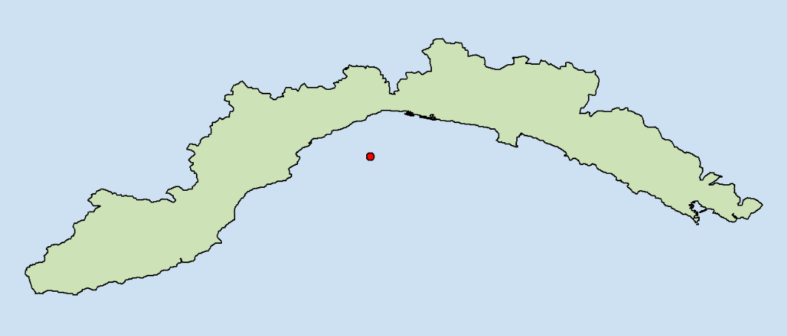
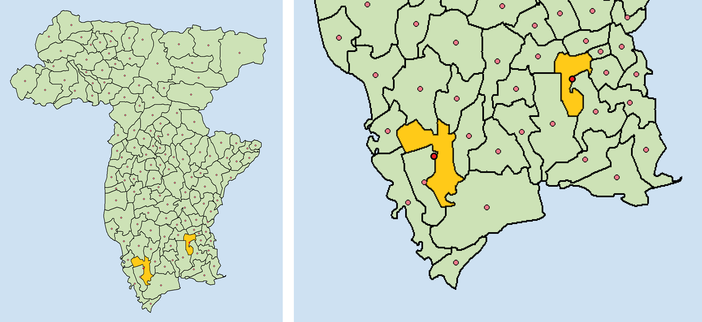
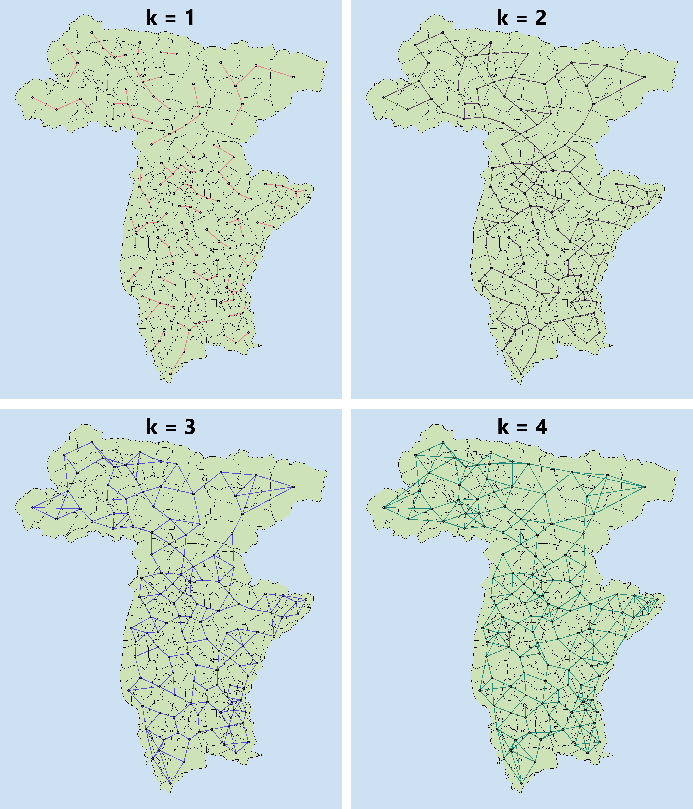
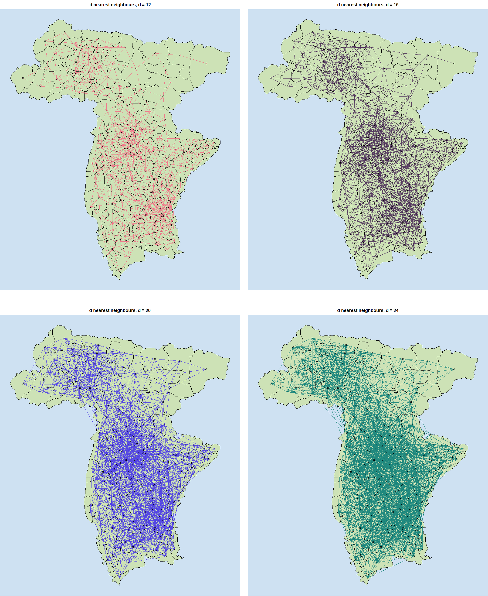

<style>
  body {text-align: justify;}
  .title {text-align: center;}
</style>

<br><div class="title">
# **Analysis of House Sale and Rent Cost in Udine**
## **Project of Geospatial Analysis and Representation for Big Data**
### *Daniele Passabì, 221229*
</div>

<br>

## **Aim**

In this notebook we will perform a *geospatial analysis* of the average house price in Udine, both for buying and renting.

Our aim is to understand whether the average price of a municipality also depends on neighbouring municipalities.

<br>

## **Import Libraries**

We import the packages needed for data analysis and visualisation.

```{r message=FALSE, warning=FALSE}

library(dplyr)    # data manipulation
library(rgdal)    # import and store a shapefile in R
library(spdep)    # analysis of spatial dependence
library(ggplot2)  # create visualizations

print("> Libraries Imported")

```

<br>

## **Import Data**

We first import the shapefile of all the municipalities in Italy.

```{r}

# import shapefile
italy_municipalities = readOGR("../data/Com01012021_g","Com01012021_g_WGS84")

# convert epsg:4326
italy_municipalities = spTransform(italy_municipalities, CRS("+init=epsg:4326"))

# show sample
head(italy_municipalities@data)

```

We filter and keep only the Udine municipalities. They must be 134.

```{r}

# Note: 30 is the Province Code for Udine

udine_municipalities = italy_municipalities[italy_municipalities$COD_PROV == 30,]
udine_municipalities@data

```

Let's visualize the content of `udine_municipalities`.

```{r fig.height=14, fig.width=12, fig.align='center'}

# create base plot
plot(
  udine_municipalities,
  col = "#CDE2B6",
  bg = "#CEE1F2", 
  lwd = 2
  )

# add name of municipality as text 
text(
  coordinates(udine_municipalities), 
  labels = udine_municipalities$COMUNE, 
  cex = 0.6, 
  col = "black"
  )

```

We now import data on house sales and rental costs and join them with our `udine_municipality` data.

```{r}

# we import the csv
house_sale_rent = read.csv("../data/udine_municipalities_house_cost.csv")

# we rename the column "Municipality" to "COMUNE", like the column in the shapefile
house_sale_rent = house_sale_rent %>%
  rename(COMUNE = Municipality)

# we join the data
udine_municipalities_with_house_cost = merge(udine_municipalities, house_sale_rent, by = "COMUNE")

# show results
udine_municipalities_with_house_cost@data %>%
  select(COMUNE, Sale, Rent)

```

<br>

## **Descriptive Spatial Statistics (Global Analysis)**

### **Centroids**

We need to assign each municipality a *unique spatial reference coordinate* to represent them. 

We can calculate the *centroids* of the municipalities in this way.

```{r}

udine_mun_coords = coordinates(udine_municipalities_with_house_cost)
udine_mun_coords[0:5,]

```

The centroids are arbitrary and may not fall within the polygon that defines them. 

One classic example is the one of Liguria and its centroid: 



Let us visualise our centroids to ensure that there are no such problems. 

```{r fig.height=14, fig.width=12, fig.align='center'}

plot(
  udine_municipalities_with_house_cost, 
  col = "#CDE2B6",
  bg = "#CEE1F2", 
  lwd = 2
  )

points(
  udine_mun_coords, 
  cex = 1,
  col = "black",
  bg = "#EF798A",
  pch = 21,
  lwd = 1.5
  )

```

There are two municipalities where the centroid is outside the territory.



This should not be a major problem for our analysis, but it is wise to take this into account for the upcoming results.

### **Neighbourhood Relationships**

Using the centroids we can now define the neighbourhood relationships amongst the municipalities (spatial units).

Of the different possible definitions of neighbourhood we have seen:

- *k-nearest neighbours*
- *critical cut-off neighbourhood*
- *contiguity-based neighbourhood*

Let us explore them.

#### **k-nearest neighbours**

The k-nearest neighbours entails that two spatial units are considered neighbours if their distance is equal, or less than equal, to the smallest possible distance that can be found between all the units. 

Following this definition of neighbourhood, each spatial unit will have the same number k of neighbours.

In the function we use `longlat = True`, so that we do not use the Euclidean distance, but a distance that takes into account the fact that the Earth is not flat.

```{r fig.height=14, fig.width=12, fig.align='center'}

# we try different values of k
knn1_UD_mun_k1 = knn2nb(knearneigh(udine_mun_coords, k = 1, longlat = T))
knn1_UD_mun_k2 = knn2nb(knearneigh(udine_mun_coords, k = 2, longlat = T))
knn1_UD_mun_k3 = knn2nb(knearneigh(udine_mun_coords, k = 3, longlat = T))
knn1_UD_mun_k4 = knn2nb(knearneigh(udine_mun_coords, k = 4, longlat = T))

```

Let's visualize the results.

```{r}

# Create function for knn plot
plot_knn_res = function(shapefile, knn_obj, tie_color) {

  # plot base map using shapefile
  plot(
    shapefile, 
    col = "#CDE2B6",
    bg = "#CEE1F2", 
    lwd = 1
  )

  # plot hover base map knn results
  plot(
    knn_obj, 
    udine_mun_coords,
    add = T,
    col = tie_color,
    lwd = 2
    )
}

```

```{r fig.height=14, fig.width=12, fig.align='center'}

#plot_knn_res(udine_municipalities_with_house_cost, knn1_UD_mun_k1, "#EF798A")
#plot_knn_res(udine_municipalities_with_house_cost, knn1_UD_mun_k2, "#593F62")
#plot_knn_res(udine_municipalities_with_house_cost, knn1_UD_mun_k3, "#574AE2")
#plot_knn_res(udine_municipalities_with_house_cost, knn1_UD_mun_k4, "#21897E")

```

*Note: to get a more comparable output, I manually merged the images.*



#### **Critical cut-off neighbourhood**

According to this criterion, two spatial units are considered to be neighbours if their distance is equal to, or less than equal to, a certain fixed distance, the critical cut-off. 

It should be remembered, however, that this distance should allow all units to have at least one neighbour.

Let us find the minimum distance required.

```{r}

knn1_UD_mun_k1 = knn2nb(knearneigh(udine_mun_coords, k = 1, longlat = T))
max_mun_distance = max(unlist(nbdists(knn1_UD_mun_k1, udine_mun_coords, longlat = T))) 

message("The maximum distance between two municipalities is ", round(max_mun_distance,2), " km")

```

Thus, the cut-off distance has to be greater than 11.72 (km).

```{r}

# We try different neighbourhood definitions for different values of the cut-off distance

dnb12 = dnearneigh(udine_mun_coords, 0, 12, longlat = T); message("dnb12"); dnb12
dnb16 = dnearneigh(udine_mun_coords, 0, 16, longlat = T); message("\ndnb16"); dnb16 
dnb20 = dnearneigh(udine_mun_coords, 0, 20, longlat = T); message("\ndnb20"); dnb20 
dnb24 = dnearneigh(udine_mun_coords, 0, 24, longlat = T); message("\ndnb24"); dnb24 

```

```{r}

# function to plot results of dnearneigh()

# Create function for knn plot
plot_dnb_res = function(shapefile, dnb_obj, tie_color, title) {

  # plot base map using shapefile
  plot(
    shapefile, 
    col = "#CDE2B6",
    bg = "#CEE1F2", 
    lwd = 1
  )
  
  # add custom title
  title(main = title) 

  # plot hover base map knn results
  plot(
    dnb_obj, 
    udine_mun_coords,
    add = T,
    col = tie_color,
    lwd = 1
    )
}

```

```{r fig.height=14, fig.width=12, fig.align='center'}

#plot_dnb_res(udine_municipalities_with_house_cost, dnb12, "#EF798A", "d nearest neighbours, d = 12")
#plot_dnb_res(udine_municipalities_with_house_cost, dnb16, "#593F62", "d nearest neighbours, d = 16")
#plot_dnb_res(udine_municipalities_with_house_cost, dnb20, "#574AE2", "d nearest neighbours, d = 20")
#plot_dnb_res(udine_municipalities_with_house_cost, dnb24, "#21897E", "d nearest neighbours, d = 24")

```

*Note: as done previously, I am merging the images for more immediate comparison.*



It is normal that as the critical cut-off increases, the number of connections increases.

In this case, however, even with the lowest value (12) of cut-off there seems to be a disproportion of connections between the north-eastern municipalities and the others.

This happens because the usual distance of the centroids tends to be much smaller than the maximum found. To make this concept clearer, we show a simple histogram of the distances. 

```{r fig.height=5, fig.width=10, fig.align='center'}

# save the data in a df for ggplot
distance_vector = unlist(nbdists(knn1_UD_mun_k1, udine_mun_coords, longlat = T))
distance_df = data.frame(distance_vector)

# show histogram of distances
ggplot(distance_df, aes(x = distance_vector)) + 
  # create histogram
  geom_histogram(
    binwidth = 0.25, 
    fill = "#69b3a2", 
    color = "#e9ecef", 
    alpha = 0.9
    ) +
  # add labels
  labs(
    title = "Distances between Spatial Units",
    subtitle = "Obtained using KNN with K=1",
    x = "\ndistance (km)",
    y = "count\n"
  ) + 
  # add vertical lines for max distance and mean distance
  geom_vline(xintercept = max(distance_vector), color = "#C5283D", size = 1.25) + 
  geom_vline(xintercept = mean(distance_vector), color = "#255F85", size = 1.25, linetype = "dotted")

```

As we can see from the picture, most of the distances are not too far from the average, which is 4.57 (represented by the blue dotted line).

However, the cutoff value we have to use is about 12 (red line), which is more than twice the average value of the distances. As a consequence, many neighbours are formed.


<br><br><br><br><br>
